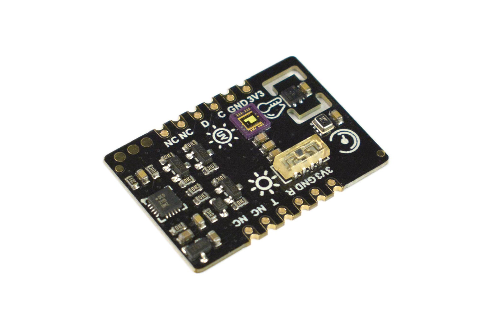
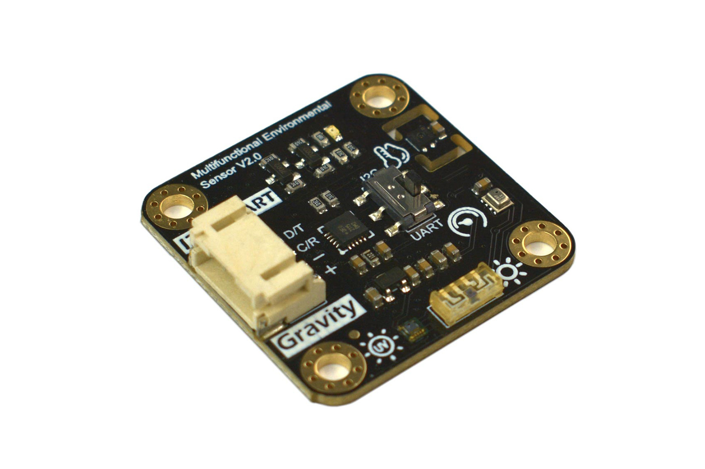

# 🌍 DFRobot Environmental Sensor (Python-only Library)

Python library for the multifunctional **DFRobot Environmental Sensor (SEN0500/SEN0501)**.  
This sensor integrates **temperature 🌡️, humidity 💧, UV index ☀️, light intensity 💡, pressure 🌪️, and altitude 🏔️** into one module.

It supports both **Gravity** and **Breakout** interfaces and communicates over **I²C** or **UART**.

👉 This is a **Python 3.8+ only** fork of the original DFRobot Arduino library, adapted for Raspberry Pi.

---

## 📦 Installation

Simply install with `pip`
```bash
pip install git+https://github.com/kallegrens/dfrobot_environmental_sensor.git@master
```

⚡️ Package will soon be available on PyPi!

## 🚀 Usage

### Run an example from the examples directory

```bash
python3 examples/control_led.py
```

### Basic code example

```python
from dfrobot_environmental_sensor import DFRobot_Environmental_Sensor

sensor = DFRobot_Environmental_Sensor()
sensor.begin()

print("Temperature:", sensor.get_temperature("C"), "°C")
print("Humidity:", sensor.get_humidity(), "%")
print("UV Index:", sensor.get_ultraviolet_intensity())
print("Light:", sensor.get_luminousintensity(), "lx")
print("Pressure:", sensor.get_atmosphere_pressure("hPa"), "hPa")
print("Altitude:", sensor.get_elevation(), "m")
```

## 🛠️ Methods

```python
def begin(self) -> int:
    """
    Initialize the SEN0500/SEN0501 sensor.
    Returns:
        int: 0 if successful, -1 if failed.
    """

def get_temperature(self, units: str = "C") -> float:
    """
    Get temperature data.
    Args:
        units (str): "C" for Celsius, "F" for Fahrenheit.
    Returns:
        float: Temperature value.
    """

def get_humidity(self) -> float:
    """Return relative humidity (%)"""

def get_ultraviolet_intensity(self) -> float:
    """Return UV intensity index"""

def get_luminousintensity(self) -> float:
    """Return luminous intensity (lux)"""

def get_atmosphere_pressure(self, units: str = "hPa") -> float:
    """
    Get atmospheric pressure.
    Args:
        units (str): "hPa" (default) or "kPa".
    Returns:
        float: Pressure value.
    """

def get_elevation(self) -> float:
    """Return altitude (meters)"""
```

## ✅ Compatibility

- Raspberry Pi (tested on Raspberry Pi 5)
- Python 3.8+ only

## 🔗 Product Links

<p align="center">
  <div style="display:inline-block; text-align:center; margin: 0 20px;">
    <br/>
    🌐 <a href="https://www.dfrobot.com/product-2522.html">SEN0500 – Fermion</a>
  </div>
  <div style="display:inline-block; text-align:center; margin: 0 20px;">
    <br/>
    🌐 <a href="https://www.dfrobot.com/product-2528.html">SEN0501 – Gravity</a>
  </div>
</p>

## 📖 Changelog

The full changelog is available in [CHANGELOG.md](./CHANGELOG.md).

### Latest Release

- **[2.0.0 – 2025-08-20]** 💥 Python-only fork
  - ✅ Python 3.8+ support with `smbus3`
  - ✅ Modernized README and examples
  - ❌ Dropped Arduino and Python 2.x support

### Previous Release (DFRobot upstream)

- **[1.1.0 – 2024-12-18]** ⚡️ Code updates from DFRobot
- **[1.0.0 – 2021-12-20]** ✨ Initial release by DFRobot (Arduino-compatible)

## 🙌 Credits

- Originally written by [tangjie133](https://github.com/tangjie133) (DFRobot), 2021
- Python 3.8+ fork maintained by [kallegrens](https://github.com/kallegrens), 2025
